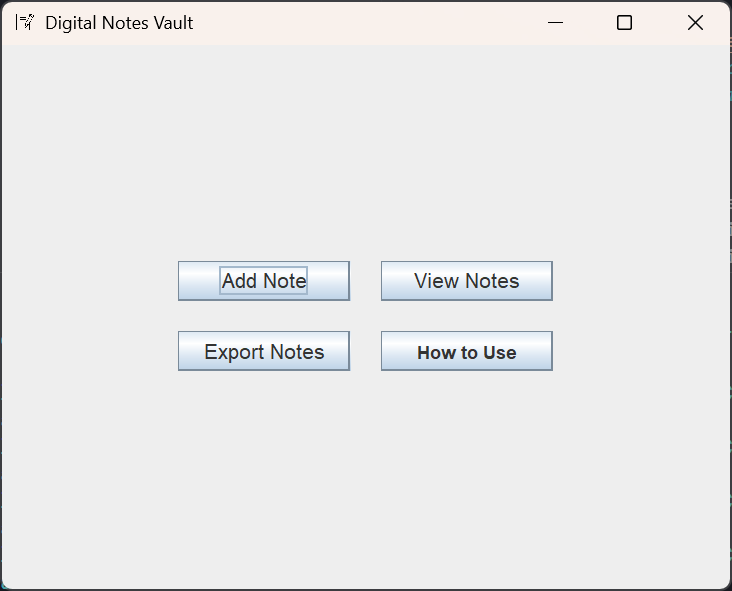

# Digital Notes Vault

Digital Notes Vault is a simple desktop application built with Java Swing for creating, viewing, and managing personal notes. It provides a user-friendly interface to store notes securely in a MySQL database.



## Features

- **Add Notes:** Easily create new notes with a title, content, and a specific tag (e.g., Work, Personal).
- **View Notes:** Display all your notes in a clear, tabular format.
- **Export Notes:** Back up all your notes to a local text file (`notes_backup.txt`).
- **Tagging System:** Organize notes using predefined tags.

## Prerequisites

Before you begin, ensure you have the following installed:

- Java Development Kit (JDK) 8 or higher
- MySQL Server
- An IDE like IntelliJ IDEA or Eclipse
- MySQL Connector/J library

## Setup and Installation

Follow these steps to get the application running on your local machine.

### 1. Clone the Repository

```bash
git clone <your-repository-url>
```

Or simply download and extract the source code ZIP file.

### 2. Database Setup

You need to create a database and the necessary tables for the application to store data.

1.  Open your MySQL client (e.g., MySQL Workbench, command line).
2.  Run the following SQL script to create the database (`digitalnotes`), tables (`tags`, `notes`), and insert some initial tags.

```sql
-- Create the database
CREATE DATABASE digitalnotes;

-- Use the newly created database
USE digitalnotes;

-- Create the 'tags' table to categorize notes
CREATE TABLE tags (
    tag_id INT PRIMARY KEY AUTO_INCREMENT,
    tag_name VARCHAR(50) NOT NULL UNIQUE
);

-- Create the 'notes' table
CREATE TABLE notes (
    id INT PRIMARY KEY AUTO_INCREMENT,
    title VARCHAR(255) NOT NULL,
    content TEXT,
    created_date DATETIME NOT NULL,
    tag_id INT,
    FOREIGN KEY (tag_id) REFERENCES tags(tag_id)
);

-- Insert some default tags for the dropdown menu
INSERT INTO tags (tag_name) VALUES ('Personal'), ('Work'), ('Urgent'), ('Ideas');
```

### 3. Configure Database Connection

1.  Open the project in your IDE.
2.  Navigate to the `src/db/DBConnection.java` file.
3.  Update the `URL`, `USER`, and `PASSWORD` constants with your personal MySQL database credentials.

### 4. Add MySQL Connector Library

1.  Download the **MySQL Connector/J** JAR file from the official MySQL website
2.  Add the JAR file to your project's build path.
    - **For IntelliJ IDEA:** Add the sql-connector.jar file to external libraries
    - **For VS Code:** Create a `lib` folder in the root directory and place the sql-connector.jar file there

### 5. Build and Run

1.  Compile the project within your IDE.
2.  Run the `Main` class located in `src/Main.java` to start the Digital Notes Vault application.

## How to Use

- **Adding a Note:** Click the `Add Note` button, fill in the title, content, select a tag, and click `Save`.
- **Viewing Notes:** Click the `View Notes` button to see a list of all your saved notes.
- **Exporting Notes:** Click the `Export Notes` button to save a backup of your notes to `notes_backup.txt` in the project's root directory.
